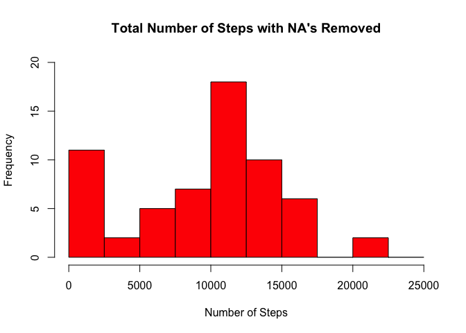
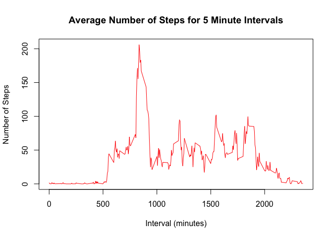
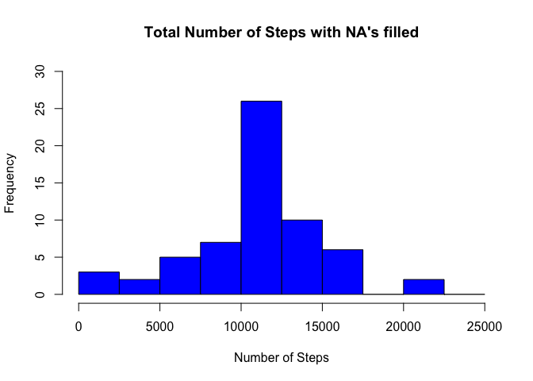
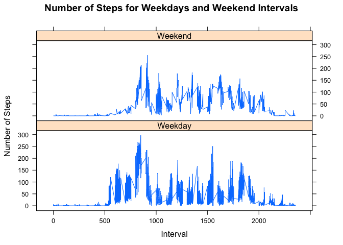

# Reproducible Research: Peer Assessment 1
## 1. Loading and preprocessing the data
The workspace is cleared and the data is loaded from the CSV file:      

```r
# Clears the workspace of any existing variables 
rm(list=ls())

# Sets the working directory 
setwd("~/Desktop/Coursera/RepData_PeerAssessment1/")

# Reads the CSV file into the data frame called "activity"
activity <- read.csv("activity.csv", stringsAsFactors = FALSE)
```
Some minor formatting is done to the data frame:

```r
# Changes the dates to date classes and rearranges the columns of the data frame
activity$date <- as.POSIXct(activity$date, format = "%Y-%m-%d")
activity <- data.frame(date = activity$date,
                       interval = activity$interval,
                       steps = activity$steps)
```
Example of the formatted data frame:

```
##         date interval steps
## 1 2012-10-01        0    NA
## 2 2012-10-01        5    NA
## 3 2012-10-01       10    NA
## 4 2012-10-01       15    NA
## 5 2012-10-01       20    NA
## 6 2012-10-01       25    NA
```
## 2. What is mean total number of steps taken per day?
First the total number of steps taken each day is calculated from the following:

```r
# Groups the steps taken from each day and calculates the total. The NA's are removed from the calculations
day.steps <- aggregate(activity$steps,
                       by = list(activity$date),
                       FUN = sum,
                       na.rm = TRUE)
names(day.steps) <- c("date", "steps")
```
Example of the formatted data:

```
##         date steps
## 1 2012-10-01     0
## 2 2012-10-02   126
## 3 2012-10-03 11352
## 4 2012-10-04 12116
## 5 2012-10-05 13294
## 6 2012-10-06 15420
```
Then the data is displayed via the following histogram:

```r
# Computes the histogram
hist(day.steps$steps,
     breaks = seq(from = 0, to = 25000, by = 2500),
     col = "red",
     ylim = c(0,20),
     xlab = "Number of Steps",
     main = "Total Number of Steps with NA's Removed")
```

<!-- -->

```r
step.mean <- floor(mean(day.steps$steps))
step.median <- median(day.steps$steps)
```
The mean is **9354** and the median is **10395**

## 3. What is the average daily activity pattern?
The average number of steps per interval is calculated:

```r
# The steps per interval are gathered and the mean for each interval is calculated
int.steps <- aggregate(activity$steps,
                       by = list(activity$interval),
                       FUN = mean,
                       na.rm = TRUE)

names(int.steps) <- c("interval", "mean")
```
Example of the formatted data:

```
##   interval      mean
## 1        0 1.7169811
## 2        5 0.3396226
## 3       10 0.1320755
## 4       15 0.1509434
## 5       20 0.0754717
## 6       25 2.0943396
```
Plots the data in a line graph:

```r
plot(int.steps$interval,
     int.steps$mean,
     type = "l",
     col = "red",
     xlab = "Interval (minutes)",
     ylab = "Number of Steps",
     main = "Average Number of Steps for 5 Minute Intervals")
```

<!-- -->

The interval at which the max number of steps occurs at is calulated from the following:

```r
max.int.pos <- which(int.steps$mean == max(int.steps$mean))
max.int <- int.steps[max.int.pos,1]
```
Interval **835** has the max number of steps.

## 4. Imputing missing values
The total number of NA's in the dataset is calculated from the following:

```r
na.count <- sum(is.na(activity$steps))
```
The total NA count is **2304**.

In order to fill in the missing data from the dataset, the average of each of the 5 minute intervals are assigned to any interval that is missing data:

```r
# Finds the indicies of the NA's in the dataset
na.ind <- which(is.na(activity$steps))

# Creates a copy of the activity dataset that will have NA values filled
activity.fill <- activity

# Loops through the dataset to find the locations of the NA values and substitutes them with the calculated mean value for that 5-minute interval
for (i in 1:length(na.ind)){
    int.val <- activity.fill[na.ind[i], "interval"]
    mean.val <- int.steps$mean[which(int.steps$interval == int.val)]
    activity.fill[na.ind[i],"steps"] <- mean.val
}

# Groups the steps taken from each day and calculates the total.
day.steps.fill <- aggregate(activity.fill$steps,
                       by = list(activity$date),
                       FUN = sum,
                       na.rm = TRUE)
names(day.steps.fill) <- c("date", "steps")
```

Then the data is displayed via the following histogram:

```r
# Computes the histogram 
hist(day.steps.fill$steps,
     breaks = seq(from = 0, to = 25000, by = 2500),
     col = "blue",
     ylim = c(0,30),
     xlab = "Number of Steps",
     main = "Total Number of Steps with NA's filled")
```

<!-- -->

The new mean and median are calculated:

```r
step.mean.fill <- floor(mean(day.steps.fill$steps))
step.median.fill <- floor(median(day.steps.fill$steps))
```
The new mean and median are **10766** and **10766** respectively. 

As you can see, the new mean and median have changed when compared to the values computed from the dataset that exluded the NA values. Both the mean and median have increased after the NA values were imputted. 

## 5. Are there differences in activity patterns between weekdays and weekends?

The dataset with filled NA values is further categorized based on whether the day of the week is a weekday or the weekend.

```r
# A new column is added to the dataset that defines the day of the week with each entry is associated 
activity.fill$weekday <- weekdays(activity$date)

# A factor variable is created that classifies each day of the week as either a weekday or a weeeknd
day.type = factor(ifelse(activity.fill$weekday == "Saturday" | activity.fill$weekday == "Sunday",
                  "Weekend",
                  "Weekday"))

# The factor variable is combined with the dataset 
activity.fill <- cbind(activity.fill,day.type)

# Groups the steps taken based on interval, day of the week, and type of day it is (ie. Weekday or Weekend)
day.type.steps <- aggregate(activity.fill$steps,
                       by = list(activity.fill$weekday,
                                 activity.fill$day.type,
                                 activity.fill$interval),
                       FUN = mean,
                       na.rm = TRUE)
names(day.type.steps) <- c("weekday","day.type","interval","mean")
```

Example of the calculated dataset:

```
##     weekday day.type interval      mean
## 1    Friday  Weekday        0 0.3815514
## 2    Monday  Weekday        0 1.4926625
## 3  Thursday  Weekday        0 5.4129979
## 4   Tuesday  Weekday        0 0.0000000
## 5 Wednesday  Weekday        0 3.9685535
## 6  Saturday  Weekend        0 0.2146226
## 7    Sunday  Weekend        0 0.2146226
```

Plots the steps taken for each interval grouped by data from the weekend and during weekdays:

```r
# Loads the lattice library
library(lattice)

# Plots the number of steps taken based on intervals for days during the week and on the weekend.
xyplot(mean ~ interval | day.type, day.type.steps,
       type = "l",
       xlab = "Interval",
       ylab = "Number of Steps",
       main = "Number of Steps for Weekdays and Weekend Intervals",
       layout = c(1,2))
```

<!-- -->
